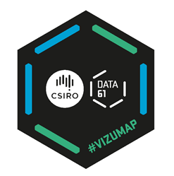

# SSA SCV Tutorial: Visualising uncertainty in your spatial data

Website: [https://StatSocAus.github.io/tutorial_vizumap](https://StatSocAus.github.io/tutorial_vizumap)

This is for research scientists wishing to visualise uncertainty on maps and keen to gain a greater understanding of visualisations available in the Vizumap R package and how to generate them.

**Presenter**: Petra Kuhnert is the Associate Science Director – University Engagement at CSIRO’s Data61. She has a PhD in Statistics from QUT, focussing more recently on the development of methods at the intersection between statistics and machine learning to develop more informative predictions for risk-based decision-making. In 2023, Petra was a recipient of two Women in AI (WAI) awards for her modelling work related to the Great Barrier Reef: 1st runner-up for the APAC Women in AI Innovator of the Year Award, and the APAC Women in AI Environment and Biodiversity Award 2023. Petra co-designed the award-winning software, "Vizumap" with Lydia Lucchesi.  Vizumap is an innovative visualisation package written in the R programming language. More recently her focus has been towards the development of emulation methods using machine learning to speed up slow running physical systems and the use of space technologies (e.g. remote sensing) to enhance the predictions of terrestrial environmental and agricultural processes.

## Objectives of the Tutorial

- To educate attendees on the importance of providing uncertainties with their spatial predictions.
- To provide an overview of the Vizumap R package, its key visualisations and main functions of the package.
- To take workshop attendees through an example that they can follow online and produce Vizumap maps.
- Run breakout sessions (3) where each group gets given a problem to visualise uncertainties on maps.  They need to use Vizumap to produce each of the visualisations, answer some questions in relation to the produced maps for their problem, put together a brief presentation and report back to the broader group.

Background: Participants should have a good working knowledge of R, and some background in modelling, particularly models of spatial and/or spatio-temporal processes and the data underpinning those.

## Course Schedule

All times are in AEDT

| time | topic |
|------|-------|
|9:00-9:05|	Welcome and Introductions | 
|9:05-10:00|	Session 1:  Introduction to the Vizumap R package and methods for visualising uncertainties on maps (incl Q&A) |
|10:00-10:15|	BREAK|
|10:15-11:00|	Session 2: Hands on tutorial that uses Vizumap to visualise uncertainties on maps using the GBR pollutant load modelling outputs|
|11:00-11:15|	BREAK|
|11:15-12:00|	Session 3: Breakout session for groups to work on one of 3 problems|
|12:00-12:25|	Presentations from each group and discussion around the problem, choice of map and features and experience with Vizumap.|
|12:25-12:30|	Close and final comments.|

[Session 1 Slides]()

[Session 2 Slides]()

[Zip file of materials]()

## Getting started
TBA

GitHub repo with all materials is 
[https://statsocaus.github.io/tutorial_highd_vis/](https://statsocaus.github.io/tutorial_vizumap/).

